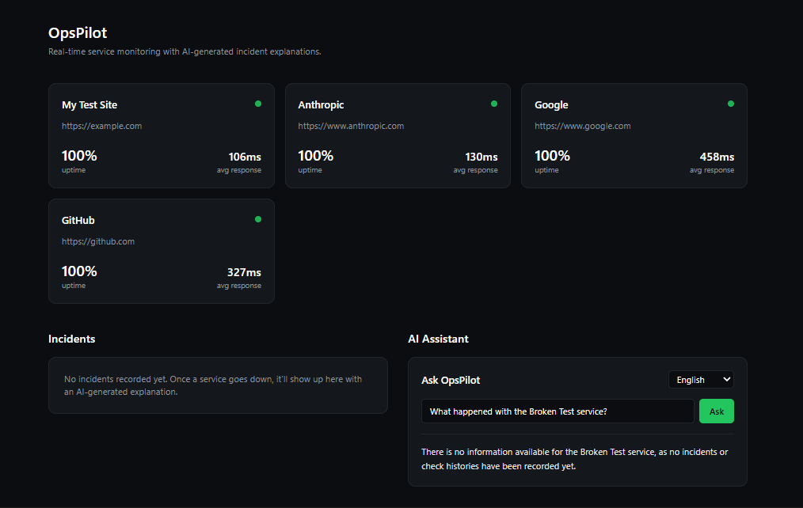

# OpsPilot

AI-powered monitoring dashboard that tracks uptime, detects incidents, and explains what broke in your language.

OpsPilot watches your services in real time and uses AI to explain what's happening when something breaks. Instead of digging through raw logs to figure out why a service went down, OpsPilot summarizes the incident, points to a likely cause, and lets you ask follow-up questions directly, in whatever language you're most comfortable with, like having a support engineer's instincts built into your dashboard.

## Features

- **Real-time monitoring** — scheduled health checks against any list of URLs/APIs, tracking status codes, response time, and uptime.
- **AI incident summaries** — when a service fails, Gemini reads the error and explains what likely broke, why, and what to check next, in plain language.
- **Multi-language support** — incident summaries and chat answers can be generated in the user's preferred language.
- **AI chat assistant** — ask questions like "why did the payments service go down last night" and get an answer pulled from real incident history.
- **Slack alerts** — get notified the moment something goes down or recovers.
- **Clean dashboard** — built with Next.js, React, and Tailwind, showing uptime, response time trends, and incident history at a glance.

## Tech stack

| Layer      | Tech                                   |
|------------|-----------------------------------------|
| Frontend   | Next.js (App Router), React, Tailwind CSS, Recharts |
| Backend    | FastAPI (Python)                        |
| Database   | PostgreSQL, SQLAlchemy                  |
| AI         | Google Gemini API                       |
| Alerts     | Slack webhooks                          |
| Scheduling | APScheduler                             |

## Project structure